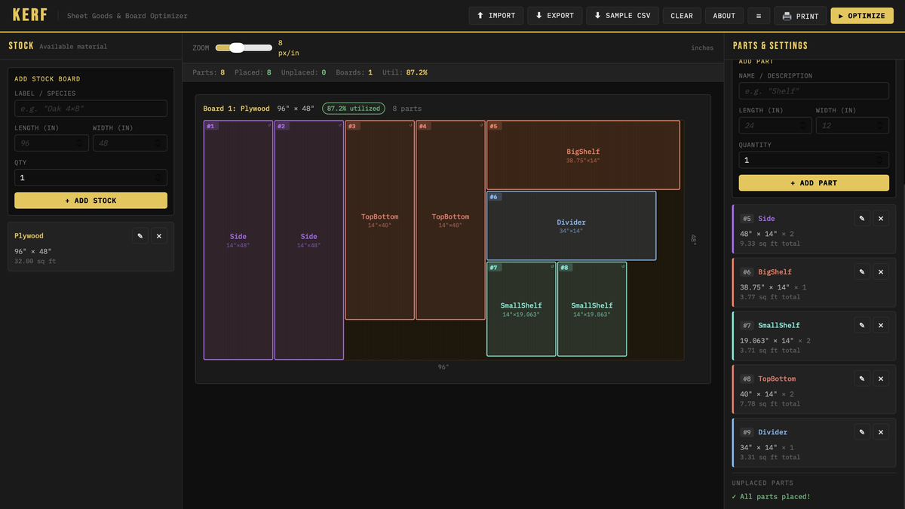

# Kerf

**Sheet goods and board cut-list optimizer for woodworkers.**

Kerf takes a list of parts you need to cut and a list of stock boards or
sheet goods you have available, then works out the most efficient cutting
layout — minimising waste and the number of boards consumed.  Results are
displayed as visual cutting diagrams with unique serial numbers on every
piece, and can be printed as shop-ready cut instructions.

Runs entirely locally in a Docker container.  No account, no internet
connection required after installation.



---

## Features

- **Visual cutting diagrams** — colour-coded parts with serial numbers,
  rotation indicators, and per-board utilization percentage
- **Smart optimization** — Maximal Rectangles algorithm with multi-trial
  search across systematic and randomised part orderings; stops early when
  further improvement is unlikely
- **Three cut strategies** — Combination (recommended), Cross-cuts first,
  Rip-cuts first
- **Grain direction** — optional 90° rotation when grain direction is not
  critical
- **Kerf width** — configurable saw blade kerf applied to every cut
- **Import / Export** — simple CSV format for saving, sharing, and
  re-loading projects
- **Print** — clean, ink-friendly shop sheet with parts legend, per-board
  cut tables (sorted top-to-bottom, left-to-right), and scaled diagrams
- **Edit in place** — modify any stock board or part after adding it
  without starting over
- **Runs on Linux** — Docker container, no Windows required

---

## Quick start

```bash
git clone https://github.com/YOUR_USERNAME/kerf.git
sudo mv kerf /opt/kerf
docker compose -f /opt/kerf/compose.yaml -p kerf up --build -d
```

Open **http://localhost:5000** in your browser.

See [INSTALL.md](INSTALL.md) for systemd auto-start, port changes,
running without Docker, and uninstall instructions.

---

## Usage

### 1 — Add stock

Enter the boards or sheet goods you have available.  Length is the
horizontal dimension; width is vertical (the same convention used in
most woodworking software).  Add multiple sheets of the same size by
setting Qty > 1.

### 2 — Add parts

Enter every piece you need to cut: name, length, width, and quantity.
Parts are assigned sequential numbers (#1, #2 …) which carry through to
the cutting diagrams and print output.

### 3 — Set parameters

| Parameter | Default | Notes |
|---|---|---|
| Kerf width | 0.125" | Material lost per saw cut |
| Min waste | 4 in² | Smallest scrap worth reporting |
| Strategy | Combination | See below |
| Allow rotation | On | Permit 90° rotation when grain allows |

**Strategies**

- **Combination** — tries all systematic orderings plus up to 50 random
  permutations, keeps the best result.  Recommended for most projects.
- **Cross-cuts first** — prioritises pieces with a large length dimension;
  suits projects dominated by long narrow parts.
- **Rip-cuts first** — prioritises pieces with a large width dimension;
  suits projects dominated by wide panels.

### 4 — Optimize

Click **▶ Optimize** or press **Ctrl+Enter**.  The solver runs in the
background and stops early once 15 consecutive trials fail to improve
on the best layout found so far.

### 5 — Print

Click **🖨 Print** to open a print-ready page containing:

- **Parts legend** — name, dimensions, and total area for every part type
- **Cut instructions** — one table per board, sorted top-to-bottom then
  left-to-right, with each piece's serial number, name, dimensions, X/Y
  offset from the board corner, and rotation flag
- **Cutting diagrams** — scaled SVG diagrams with serial numbers

---

## CSV format

Projects can be saved and loaded as plain CSV files.

```
type,label,length,width,qty
stock,Plywood 4x8,96,48,2
part,Side Panel,72,11.25,2
part,Shelf,34.5,11.25,4
part,Top/Bottom,36,11.25,2
part,Back Panel,72,36,1
part,Toe Kick,34.5,3.5,1
part,Faceframe Rail,36,2.5,3
```

- `type` must be `stock` or `part`
- All dimensions are in **inches** (decimals, e.g. `11.25` for 11¼")
- An optional header row is auto-detected and skipped on import
- Files can be dragged and dropped onto the Import dialog

---

## Algorithm

Kerf uses the **Maximal Rectangles** packing algorithm with the
**Best Short Side Fit (BSSF)** placement heuristic.

After each piece is placed, every free rectangle that overlaps the placed
area is split into up to four sub-rectangles (left, right, top, bottom
strips), and rectangles fully contained inside a larger one are pruned.
This preserves the complete irregular free space for subsequent pieces —
unlike guillotine cutting, which permanently discards L-shaped corners.

The outer search tries multiple part orderings (largest area first,
smallest first, longest first, widest first, largest perimeter first, and
random permutations) against multiple stock orderings (smallest board
first, largest board first, as entered).  When `allow_rotate` is enabled,
both rotation-on and rotation-off are explored so the global best wins
regardless of what local placement decisions the heuristic makes.

Scoring priority: **fewest unplaced parts → fewest boards used → highest
average utilization**.

---

## Development

```bash
git clone https://github.com/YOUR_USERNAME/kerf.git
cd kerf
pip install flask
python app.py          # runs on http://localhost:5000 with auto-reload
```

Project layout:

```
kerf/
├── app.py             # Flask app + optimization algorithm
├── templates/
│   └── index.html     # Single-page UI (vanilla JS, no build step)
├── Dockerfile
├── compose.yaml
├── docs/
│   └── screenshot.svg
├── INSTALL.md
├── LICENSE            # GNU GPL v3
└── README.md
```

Pull requests and issue reports are welcome.

---

## License

Copyright &copy; 2025 Paolo Benvenuti

This program is free software: you can redistribute it and/or modify
it under the terms of the [GNU General Public License v3](https://www.gnu.org/licenses/gpl-3.0.html).

This program is distributed in the hope that it will be useful, but WITHOUT
ANY WARRANTY; without even the implied warranty of MERCHANTABILITY or FITNESS
FOR A PARTICULAR PURPOSE.

---

## Support This Project

If you find Kerf useful, consider [buying me a coffee](https://www.paypal.com/donate/?business=EV97LDH6TEU5Q&no_recurring=0&currency_code=CAD). ☕
